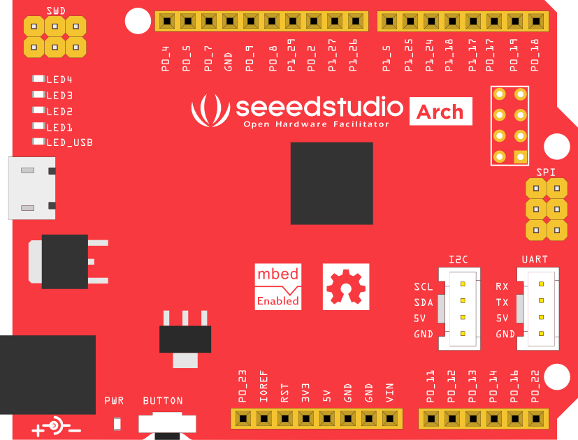
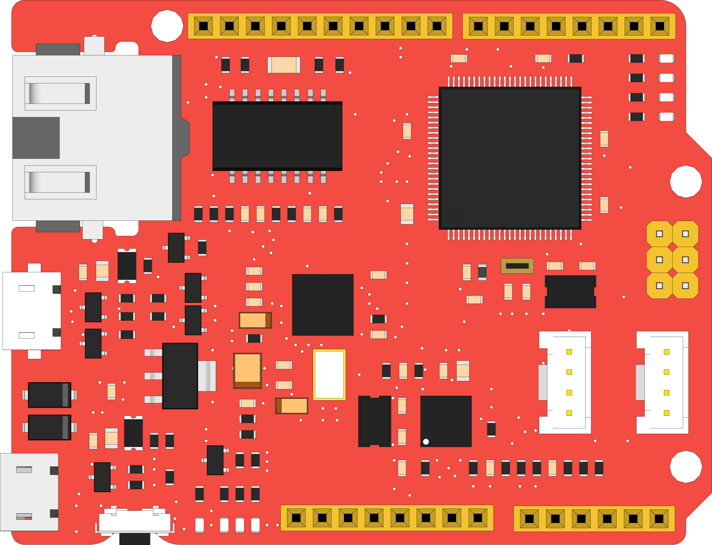
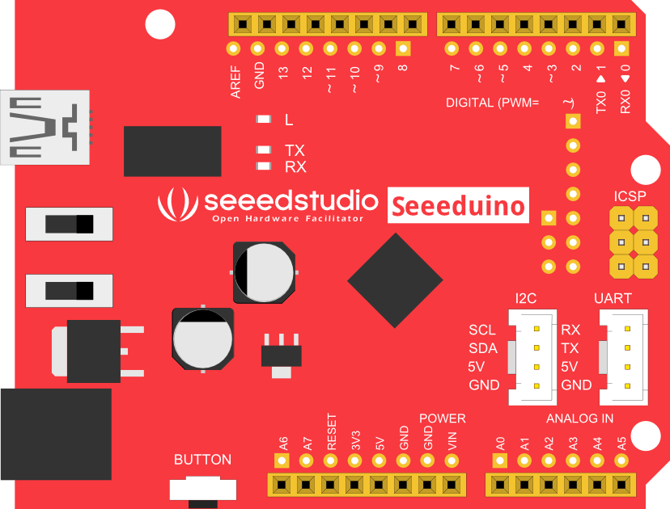

There are some svg and fritzing files for you to write attractive documents. Have fun!

### Arch V1.0
Arch is an mbed enabled development board which combines some advantages of mbed and Arduino.

### Arch Pro V1.0
Arch Pro, another mbed enabled development board, is a variant of mbed LPC1768 with build-in ethernet,
usb host/device. With a variety of Shield and Grove modules and lots of software libraries for Arch Pro, you can implement Ethernet, USB and NFC applications rapidly and easily.

### Seeeduino V3.0
Seeeduino is an Arduino compatible board based on Arduino Duemilanove 328. There are remarkable changes of the design to improve the flexibility and user experience.

